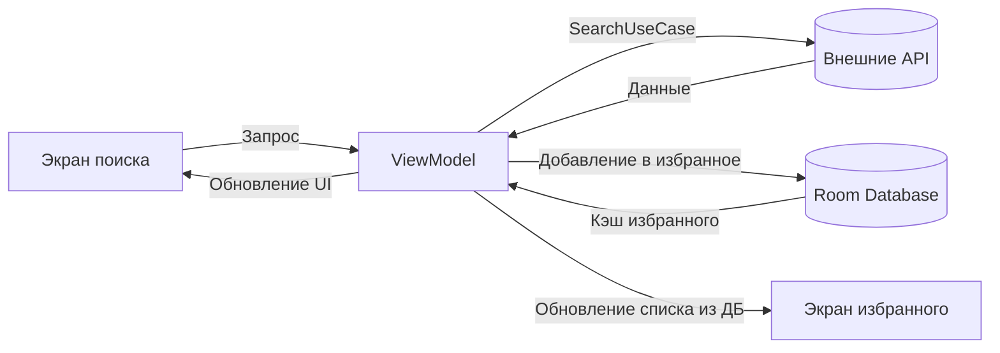

# RateContent 🎬🎮📚

Android-приложение для поиска фильмов, игр и книг с отображением средних оценок.  
Возможность добавления в избранное с персональной оценкой.

## 🌟 Основные функции
- Поиск по трем категориям: фильмы, игры, книги
- Отображение средней оценки из открытых источников
- Персональное оценивание и добавление в избранное
- Локальное хранение избранных позиций

## 🛠 Технологический стек
- **Язык**: Kotlin
- **UI**: Jetpack Compose
- **DI**: Hilt
- **Локальная БД**: Room
- **Сетевое взаимодействие**: 3xRest API, Retrofit + Moshi
- **Асинхронность**: Coroutines, Flow, StateFlow
- **Архитектура**: MVVM, Clean Architecture

## 🏗 Архитектура приложения

MIT License © Дмитрий Тимонин.
